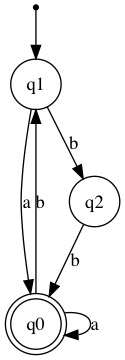

# dfa-sat

Learning Deterministic Finite Automata (DFA) from Examples Using SAT

Implements the reduction to SAT for learning (synthesizing) a DFA 
that accepts a given set of strings, and rejects another given set
described in [Heule & Verwer, 2010].
The input for the reduction is a file with the two set of strings
and an integer N. The output is a CNF theory that is satisfiable
iff there is a DFA with N states that is compatible with the input
file. In the positive case, the DFA can be obtained from a model
for the theory.

# Build

Go to the src/ folder and execute 'make'.

# Format

The file begins with a line containing two integers n and m
where n is the number of symbols in the alphabet, and m is
the number of samples (strings) in the file. Then, a line
containing the integer n followed by n blank-separated strings
specify the symbols in the input alphabet. (The symbols are
not necessarily of lenght equal to 1.)

For example, the file preamble

```
2 6
2 a b
```

tells that the file contains a sample of 6 strings made from
an alphabet of two 'symbols' which are ``a`` and ``b``.

The last part of the file contains the positive and negative
samples. First, a single line containing number p less than 
or equal to m tells that there are p positive samples (i.e.
strings that should be accepted by the DFA). After this line,
there are p lines, each containing one string. Each such line
begins with an integer that tells the length of the string (0
if the string is empty) followed by a blank-separated list of
symbols from the alphabet that make up the string.
The negative samples are specified in a similar way.

For example, the file

```
2 6
2 a b
3
1 a
4 a b a a
2 b b
3
3 a b b
1 b
0
```

describes a sample of 6 strings over the alphabet { a, b }
with 3 positive samples: ``a``, ``abaa``, and ``bb``, and
3 negative samples: ``abb``, ``b``, and the empty string.

# Executable

The executable src/dfa accepts the following options and arguments

```
src/dfa-sat [--decode] [--disable-redundant] [--disable-symmetries-break-using-graph-clique] [--enable-redundant-graph-edges] <prefix> <K>
```

where ``<prefix>`` is the prefix for all files, and ``K`` is number of
colors (states in the DFA). The option ``--decode`` is used to decode
a model found by minisat. If it is specified, the model is assumed to 
be in the file ``<prefix>_<K>_model.cnf``. The resulting DFA is
generated in .dot format in the file ``<prefix>_<K>_dfa.dot``. A PDF
representation of the DFA can be obtained using ``dot``:

```
dot -Tpdf <prefix>_<K>_dfa.dot > <prefix>_<K>_dfa.pdf
```

If the option ``--disable-redundant`` is enabled (not recommended),
then redundant clauses are not generated. 
The option ``--disable-symmetries-break-using-graph-clique`` disables 
the generation of clauses that break symmetries which can be specially 
effective when there is no solution for a given ``K``. It is not 
recommended to disable such clauses.
The option ``--enable-redundant-graph-edges`` is used to add clauses
associated with the edges of the induced undirected graph. The number
of such edges, and thus clauses, may be quite large. Since these are
redundant clauses, we don't recommend the use of this option in 
general. However, it could be useful in some cases.

# Examples

The folder examples/ contains some examples. To run dfa-sat on
'example' from the examples/ folder, execute:

```
../src/dfa-sat example 3                            # generates example_3_theory.cnf
minisat example_3_theory.cnf example_3_model.cnf    # generates example_3_model.cnf
../src/dfa-sat --decode example 3                   # generates example_3_dfa.dot
dot -Tpdf example_3_dfa.dot > example_3_dfa.pdf     # generates example_3_dfa.pdf
```

This generates a DFA with 3 states for the strings in ``example_sample.dat``.
The generated DFA is the following:



Clearly, this DFA accepts ``a``, ``bb``, and ``abaa``, and rejects (does 
not accept) ``<empty>``, ``b``, and ``abb``. There is no DFA with 1 or
2 states that is compatible with this sample (i.e. with the positive and
*negative* strings in the sample).


# References

* Marijn J.H. Heule and Sicco Verwer. *Exact DFA Identification Using SAT Solvers*.
Int. Conf. Grammatical Inference (ICGI-2010). Pages 66-79. 2010.
